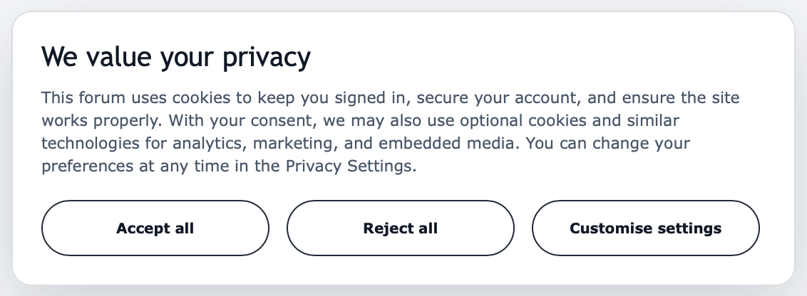

# Consent Manager

<i>Modern cookie consent for phpBB</i>

<kbd></kbd>

 

Simple, GDPR-ready privacy controls with category-based consent, ACP management tools, and extension-friendly integrations.

## Features

- Consent banner and preference modal
- Category-based consent options
- Deferred script and iframe media loading
- Consent logging with CSV export and deletion tools
- Consent version resets
- Google Consent Mode
- ACP-managed categories, integrations, translations, and audit logs
- PHP and JavaScript integration APIs

### Supported categories:

- Necessary
- Analytics
- Marketing
- Embedded media

Necessary cookies stay enabled. The rest requires consent.

## For phpBB extension developers

Consent Manager makes it easy for extension authors to ensure analytics, embeds, advertising, and other non-essential scripts only load after user consent has been granted.

See the [Developer Documentation](DOCUMENTATION.md) for a complete guide.

## License

[GNU General Public License v2](license.txt)
